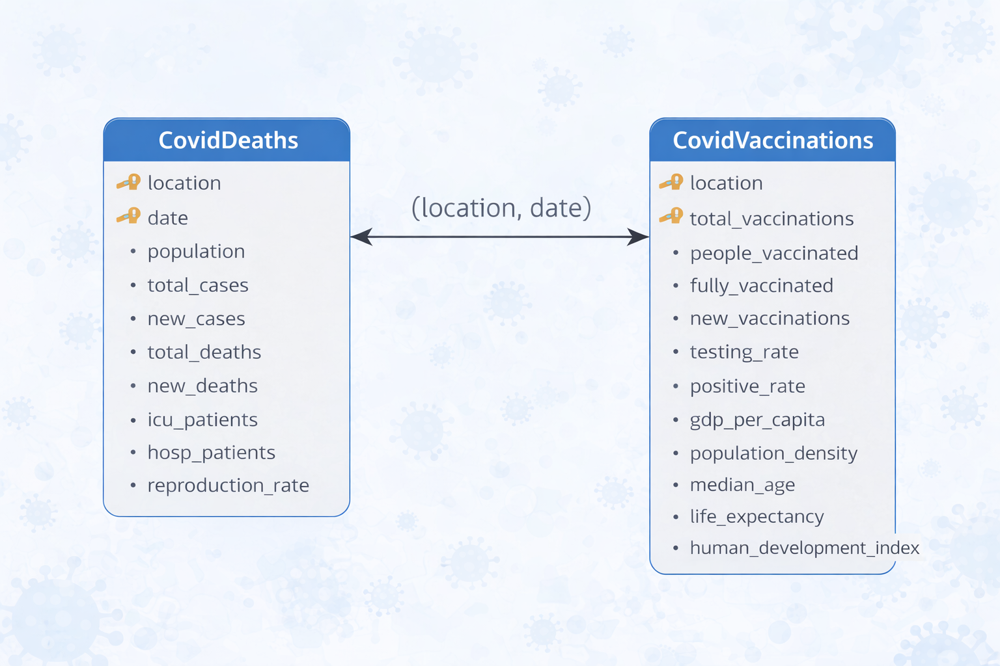
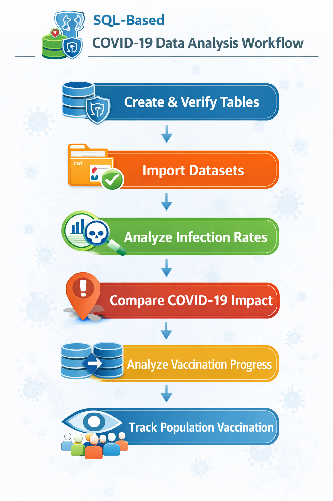
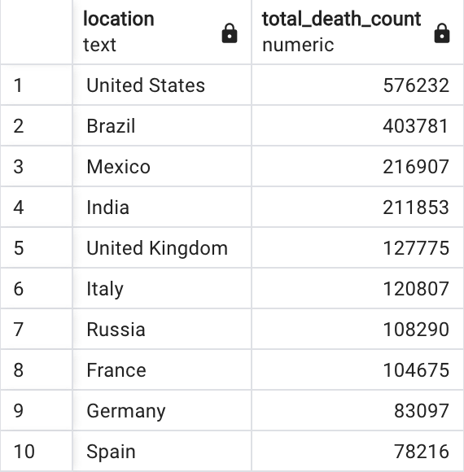

# COVID-19 Data Analysis using PostgreSQL

## Project Overview

This project focuses on analysing global COVID-19 data using PostgreSQL by examining infection trends, mortality rates, and vaccination progress across different countries and continents.

The main objective of this project is to:

- Import real-world COVID-19 datasets into PostgreSQL
- Perform data preprocessing and cleaning
- Conduct Exploratory Data Analysis (EDA)
- Analyse infection rates across countries
- Evaluate COVID-19 mortality rates
- Compare pandemic impact across continents
- Track vaccination progress over time
- Perform rolling calculations using SQL Window Functions
- Create Views for reporting and visualisation

This project demonstrates an end-to-end SQL data analysis workflow starting from raw dataset ingestion to analytical insight generation.

---

## Dataset Description

The datasets used in this project contain information related to COVID-19 cases, deaths, and vaccinations across different countries.

### CovidDeaths Dataset

The dataset contains:

- Location
- Date
- Population
- Total Cases
- New Cases
- Total Deaths
- New Deaths
- ICU Patients
- Hospital Patients
- Reproduction Rate

---

### CovidVaccinations Dataset

The dataset includes:

- Total Vaccinations
- People Vaccinated
- Fully Vaccinated Population
- New Vaccinations
- Testing Rate
- Positive Rate
- GDP per Capita
- Population Density
- Median Age
- Life Expectancy
- Human Development Index

The dataset contains both:

- *Demographic Features*
- *Healthcare Indicators*
- *Vaccination Metrics*

which makes it suitable for performing pandemic trend analysis using SQL.

---

## Database Schema

  

---

## Project Workflow

The following workflow outlines the key steps in the project:

- Created structured PostgreSQL tables for CovidDeaths and CovidVaccinations datasets
- Imported CSV datasets and verified successful data loading
- Analysed infection rate and death percentage across countries
- Identified countries and continents with highest COVID-19 impact
- Calculated global daily totals of cases and deaths
- Joined deaths and vaccination datasets for combined analysis
- Computed rolling vaccination totals using SQL Window Functions
- Created temporary table and view to analyse percentage of population vaccinated

  

---

## Data Preprocessing

The following preprocessing steps were performed on the dataset:

- Creation of structured tables in PostgreSQL
- Importing CSV datasets into database tables
- Data type consistency checks
- Filtering continent-level aggregated data
- Joining deaths and vaccination datasets
- Preparing data for analytical queries

---

## Exploratory Data Analysis (EDA)

EDA was performed to understand:

- COVID-19 infection trends
- Death percentage across countries
- Percentage of population infected
- Countries with highest infection rate
- Countries with highest death count
- Continent-wise pandemic impact
- Global daily case and death trends

### Sample Analytical Output

Example showing countries with highest death count:

  

---

## Vaccination Analysis

Vaccination progress was analysed by:

- Joining CovidDeaths and CovidVaccinations datasets
- Calculating rolling sum of new vaccinations
- Partitioning vaccination data by location
- Ordering vaccination progress by date

SQL Window Functions were used to track cumulative vaccination progress over time for each country.

---

## Temporary Table Creation

A temporary table:

*percent_population_vaccinated* was created to store:

- Location
- Date
- Population
- New Vaccinations
- Rolling Vaccination Count

Vaccination percentage of the population was calculated using:

- Rolling vaccination totals
- Population data

---

## View Creation for Visualisation

A SQL View:

*population_vaccinated* was created to:

- Combine deaths and vaccination datasets
- Store rolling vaccination totals
- Enable easy integration with BI tools such as:

  - Tableau
  - Power BI
  - Excel

for dashboard creation and visual analytics.

---

## SQL Concepts Used

The following SQL concepts were implemented in this project:

- Joins
- Aggregate Functions
- Filtering Techniques
- Window Functions
- Rolling Calculations
- Temporary Tables
- Views
- Data Transformation
- Data Type Handling

---

## Conclusion

This project successfully demonstrates how SQL can be used to:

- Analyse real-world pandemic datasets
- Identify infection and mortality trends
- Compare COVID-19 impact globally
- Track vaccination progress over time

This project highlights the importance of:

- Data preprocessing
- Exploratory Data Analysis
- Aggregation
- Window Functions
- Analytical querying

in extracting meaningful insights from large datasets.

---

## Future Improvements

- Dashboard development using Power BI or Tableau
- Time-series trend analysis
- Automated ETL pipeline
- Cloud-based database deployment

---

## Author

### Samad Zaheer

Master of Information Technology (Data Science)  
Queensland University of Technology (QUT)